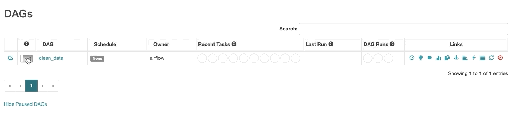
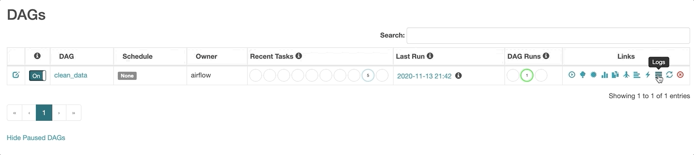

# ML Intern Takehome Challenge

This README describes how to set up your development environment. The instructions for the challenge are here: [Task](Task.md).

```
ml_takehome
│   README.md | Development instructions
|   Task.md   | Takehome challenge instructions
│   docker-compose.yml | Sets up the containers & env vars
│
└───airflow | Setup files for launching Airflow
│   
└───dags | Airflow will automatically discover any files here.
    │   clean_data.py | The provided sample pipeline
│   
└───data | The datasets
    │   search_request.csv
    │   search_result_interaction.csv
```

## Airflow: Setup Development Environment 
The environment is setup with [docker-compose](https://docs.docker.com/compose/) to get you up and running as quickly and easily as possible. We don't expect you to know how to use docker/docker-compose. 
* Install [Docker Desktop](https://www.docker.com/get-started) for your OS
* Then in this folder: `docker-compose up -d`
* If everything works, you'll see the Airflow UI at http://localhost:8080/admin
  * From here, you can see the dags that are available to run (everything in the `dags` folder), run them, and look at the status of the run.
* Your code to clean the data should be added to the `dags` folder and Airflow will automatically update with any new files you add there
* If something is not working, you can look at the container logs.
* To look at logs from:
  * the Airflow scheduler: `docker-compose logs scheduler`
  * the Airflow webserver `docker-compose logs server`

## Writing a DAG
You're provided a full boilerplate DAG (`data_clean.py`) in the `dags` folder that you're welcome to modify as necessary. It has all you need to get started, but we recommend that you skim through the [tutorial](https://airflow.apache.org/docs/stable/tutorial.html) that it's based on.

## Triggering & Looking at DAG Logs
* To trigger your DAG, go to the Airflow UI (http://localhost:8080/admin)
* Find your DAG in the list and enable it by toggling the "On/Off" switch
* Then click the little play button on the right to trigger
  

* To view logs from the run, click the logs button on the right (looks like a hamburger menu)
  
