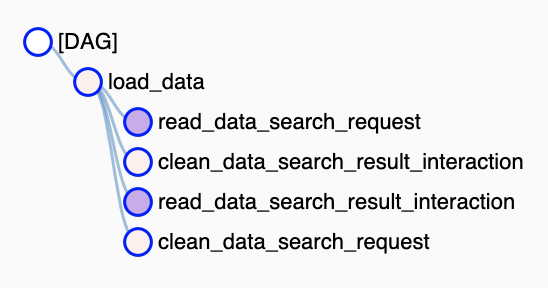

# The ML Intern Takehome Challenge

A product manager wants to use real data from our users to improve our search system, but Vimeo has so many search logs, and our team has so little time. The data is messy and we’re not sure how to use it to improve our results. We need your help to automate the cleaning process and propose a solution that can consume the cleaned data to superpower our search. 
 

## Task
We expect this two-pronged task to take about 3 hours. 

* **Data Processing**: Create a data processing pipeline/service for our clip search logs that stores the cleaned logs in a database
* **Proposal for ML Powered Search**: Propose a solution using these cleaned logs to enrich a user’s queries. Optionally, you can choose something different from query enrichment. For example, using ML to rank search results, enrich the search documents, etc. 

    <b>A high-level diagram of the assignment</b>
    

## Requirements
You will be provided with boilerplate code that sets up a sample pipeline and a SQLite database. The boilerplate will run your pipeline in [Apache Airflow](https://airflow.apache.org/), an open source workflow scheduler that many data engineers use. The end product will be a [DAG](https://www.astronomer.io/blog/what-exactly-is-a-dag/) (directed acyclic graph), which is a graph of tasks with each task represented as a node. A DAG defines what order the tasks run and if any tasks need to be finished before the next one can run.

|                                                                                                                                                                                                        |
| ---------------------------------------------------------------------------------------------------------------------------------------------- |
|                                                                                                                                                                      |
| **The incomplete boilerplate DAG**: `load_data` is a task that must finish before any of the next tasks can run, but all 4 of the “children” can be run in parallel (they don’t depend on each other). |
 

### The Pipeline
The sample pipeline (`dags/clean_data.py`) will load 2 datasets into the default SQLite database that is enabled by default in Airflow. Your task will be to modify/add to that code. 

* The `read_data_* `and `clean_data_*` tasks are examples. You can delete/modify them as you wish.
* `load_data `is the base task that simulates the environment (as if you were given populated tables to work from). It can be modified too, but you should document what you’re doing and why.

When the pipeline is run, the cleaned version of both datasets should be stored in 2 new tables in the SQLite database, `clean_search_request` & `clean_search_result_interaction`. 

All tasks should appropriately log error messages.

*Expected Result:*

* `clean_search_request` & `clean_search_result_interaction` tables with clean data
  * No duplicates
  * All click data should have a corresponding search request
  * Timestamps should have a standardized format
  * Should contain all the same columns as the given data (feel free to add more)
* If there are errors, the tasks should log them (Bonus: in your docs, propose what to do with the errors.)

### The Proposal
* The proposal portion can be as simple as a set of bullet points, but any inspiration and algorithms should be cited. 
* Your proposal should answer the following questions:
  * What data would you need, especially any that’s not provided? 
  * What are the strengths and weaknesses of your proposal?
  * How would you evaluate your models? 

## The Data
You have a sample set of search logs to explore and run tests on. The search logs are split into the following tables:

* **search_request:** A table with data about the initiating search request. It contains the query and other search metadata, including a unique search ID and user ID 
* **search_result_interaction:** A table with data about the clips the user clicked on from the initiating search request. the clip(s) the user clicked on attributable to the original search by search ID 

As you’re exploring, you can take a look at the [Vimeo API](https://developer.vimeo.com/api/reference/videos#get_video) to get info about particular clips that the user clicked, but it’s not required. You may also want to take a look at what data is available about clips that you can use in your proposal. The API response format for videos gives you a good sense of what’s available: https://developer.vimeo.com/api/reference/responses/video

**search_request:**
|                   |                                       | 
| ----------------- | ------------------------------------- | 
| **search\_id**    | The id for the initial search request |
| **search\_query** | The search query                      |
| **ts**            | The timestamp of the search request   |
| **cuid**          | Unique identifier for this user       |
| **total**         | Total results from the search         |
 

**search_result_interaction:**
|                   |                                       | 
| ----------------- | ------------------------------------- | 
| **search\_id**    | The id for the initial search request |
| **ts**            | The timestamp of the click event      |
| **cid**           | The clip ID of the result clicked on  |
| **position**      | The position of the result clicked on |
 

## What we’re looking for
* Clean, readable and well documented code in your data processing service
* Thoughtfulness about how your proposal informed your data processing approach (or didn’t)
* Ability to incorporate ideas from outside literature (papers or technical blog posts)
  * Or alternatively, thoughtful architecturing on your own
* You have fun while building this.

## Bonus
* A Jupyter Notebook with your data exploration
  * This is a good opportunity to explain your work outside of documentation if it's complex
* Tests for your pipeline
* Taking into account (in your proposal) metadata from the clicked on clips and/or other relevant activity
* Creative ways to supplement the data you have (using NLP techniques/outside APIs/etc.)
* If your data doesn’t need much cleaning and your proposal is very simple, feel free to create a POC (Proof of Concept).
  * Think of this as a hackathon-type goal. It doesn't need to fully function, just give an idea of inputs and outputs.

## Resources
* [Query Understanding, Divided into Three Parts](https://medium.com/@dtunkelang/query-understanding-divided-into-three-parts-d9cbc81a5d09)
* [Machine Learning in Search](https://lucidworks.com/ai-powered-search/machine-learning/)
